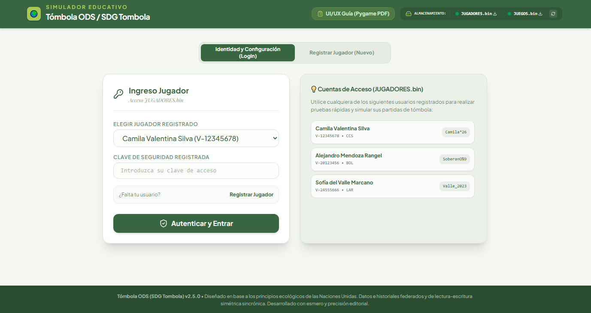
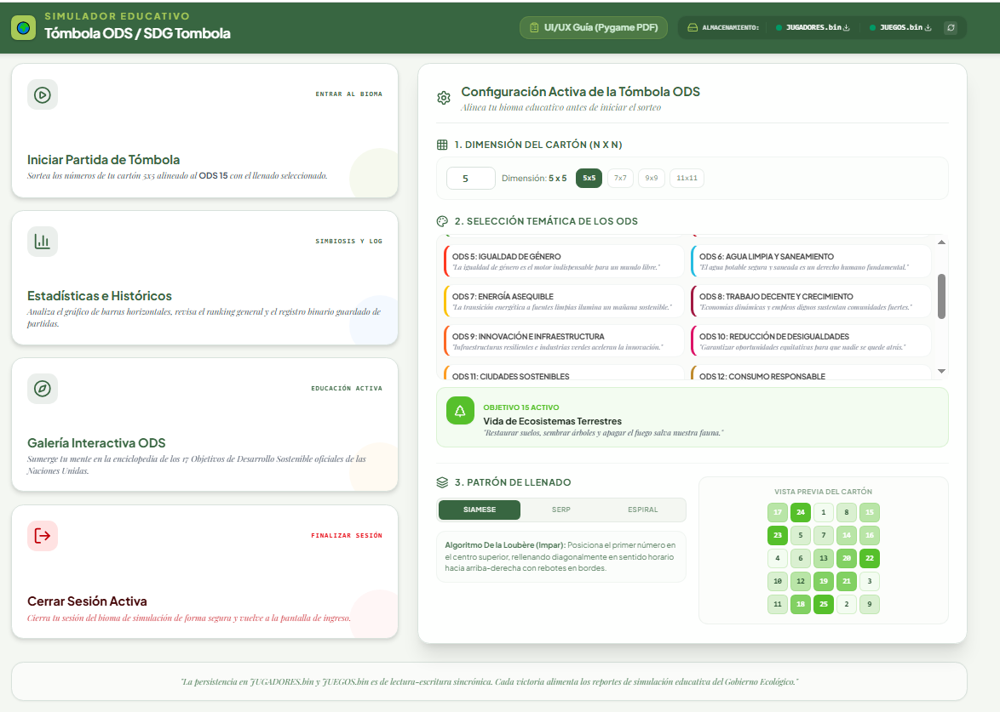
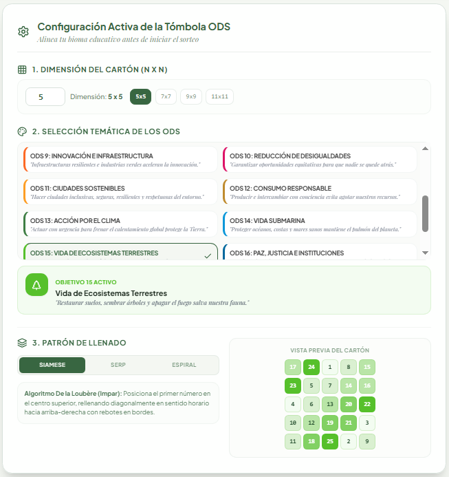
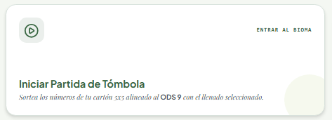
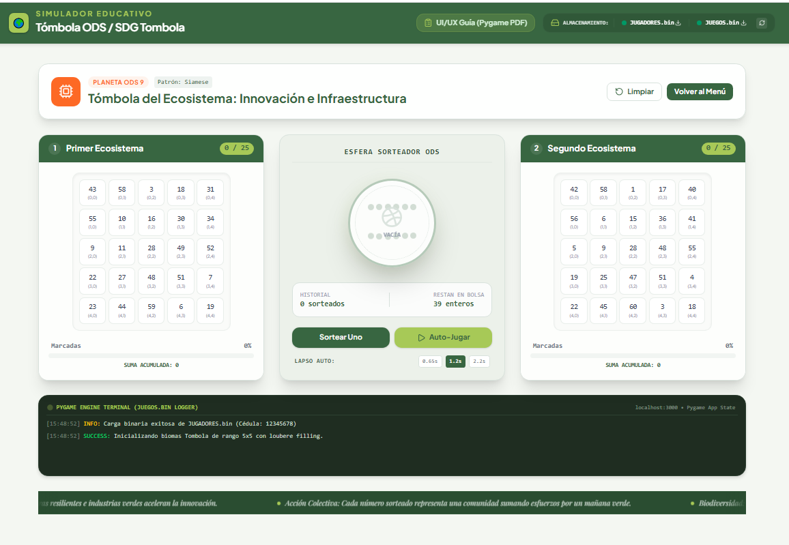
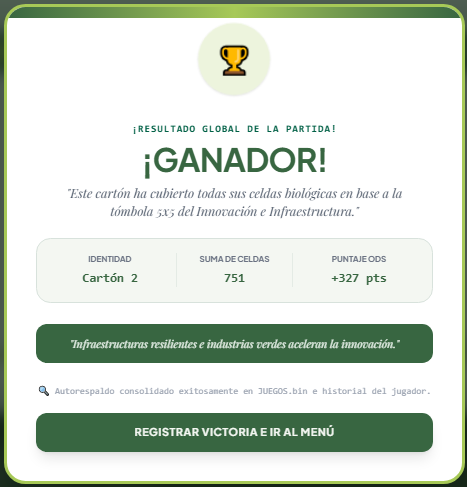

# Frontend Flow

## 1. Overview
Describes the complete user journey through the application's graphical interface, from the start to report generation.
## 2. Screen Map
General representation of all available screens and how they connect.
### Main Screens
- **Home:** Access to registration or login.
- **Registration:** Creation of a new player.
- **Login:** Authentication with ID and password.
- **Main Menu:** Options to play, view reports, or log out.
- **Card Configuration:** Selection of size and SDG theme.
- **Card Display:** Display of the main and supplementary cards.
- **Game:** Raffle in progress.
- **Results:** Winner screen and summary.
- **Reports:** View rankings, historical data, and graphs.
## 3. Registration Flow
1. The user selects "Register".
2. They complete their ID number, name, gender, date of birth, state, and password.
3. The system recursively validates the password and displays real-time feedback.
4. If the data is valid, it is saved in `JUGADORES.bin`.
5. They are redirected to the main menu or login page.
## 4. Login Flow

1. The user enters their ID number and password.
2. The system verifies the credentials against `JUGADORES.bin`.
3. If they are correct, they access the main menu.
4. If the login fails, an error message is displayed, and the user is allowed to retry.
## 5. Card Creation Flow

1. The user selects "Play".

2. They choose the NxN dimension (odd, between 5 and 15).
3. Select the SDG theme for the pair of cards.
4. The system generates the main and supplementary cards.
5. The filling sequence is displayed before starting the game.
## 6. Game Flow

1. The user confirms the cards.
2. The system begins drawing random, non-repeating numbers.

3. Matching numbers are visually marked on the cards.
4. Educational messages about the SDGs appear at the bottom.

5. When a card completes the figure, "WINNER" is announced.
6. The sum of the cells on the winning card is displayed.
## 7. Results Flow
1. The winning card and the score obtained are displayed.
2. The option to play another round or go to the menu is offered.
3. The system saves the game in `JUEGOS.bin`.
## 8. Reporting Flow
1. The user accesses "Reports".
2. They can choose between:
- List of players and games.
- Gantt chart of frequencies.
- Game history.
- Top 5 players.
3. The user defines a date range when applicable.
4. The system generates the report and saves it to a physical file.
## 9. Error Handling
- Invalid entries must display clear messages in Spanish.
- Authentication failures must not block the application.
- Binary file read/write errors must be reported to the user.
## 10. Interface States
- **Initial State:** Welcome screen.
- **Authenticated State:** Main menu enabled.
- **Game State:** Cards visible and draw active.
- **Completion State:** Results and continuation options.